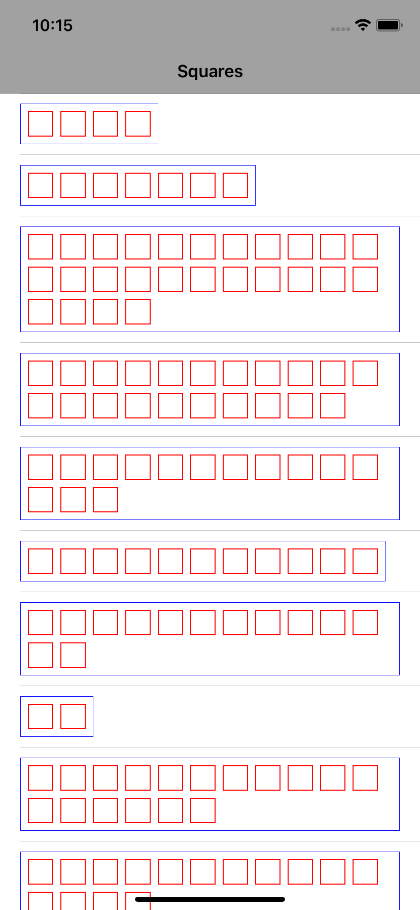
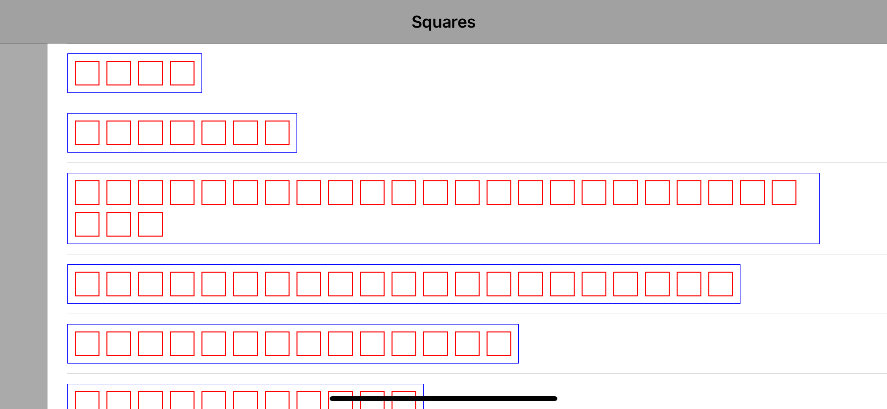

# Square
# How to use the intrinsicContentSize in a custom UIView. Where/when to calculate and to update the size?

Inspired by this [question](https://developer.apple.com/forums/thread/682973) in the Apple forums.

This project creates a custom `UIView` called `SquareView` which uses intrinsicSize to let AutoLayout automatically adopt to different content. 

`SquareView` just draws a given number of squares of a given size with given spacing. When all squares don't fit into a single row, the content is wrapped and drawing follows below. Thus the height of the view depends on the different properties (number of squares, square size, spacing, etc.)

This is very much like a UILabel but instead of words or letters simple squares are drawn. 




For simplicity, everything is in a single file `SquareViewController.swift`, no storyboards.

# Let's begin
## Step 1

In `class SquareView : UIView` the key is to define a "property called preferredMaxLayoutWidth, which specifies the maximum line width for calculating the intrinsic content size.

Since we usually don't know this value in advance, we need to take a two-step approach to get this right. First we let Auto Layout do its work, and then we use the resulting frame in the layout pass to update the preferred maximum width and trigger layout again." 

[Learn more: Intrinsic Content Size of Multi-Line Text](https://www.objc.io/issues/3-views/advanced-auto-layout-toolbox/#:~:text=Line%20Text)

```
override func layoutSubviews() {
    super.layoutSubviews()
    preferredMaxLayoutWidth = self.frame.size.width
    
    invalidateIntrinsicContentSize()
    setNeedsDisplay()
    super.layoutSubviews()
}
```

## Step 2

Now that we have our `preferredMaxLayoutWidth` we can compute the `intrinsicContentSize`:

```
override var intrinsicContentSize: CGSize {
        
    let width = squareHeight * CGFloat(squares) + padding * CGFloat(squares) + padding
    
    if width < preferredMaxLayoutWidth {
        let height = squareHeight + padding + padding
        let size = CGSize(width: width, height: height)
        return size
    }
    else {
        let vertSquares = ceil((width / preferredMaxLayoutWidth))
        let height = squareHeight * vertSquares + padding * vertSquares + padding
        let size = CGSize(width: preferredMaxLayoutWidth, height: height)
        return size
    }
}
```

## Step 3

In the `class SquareCell: UITableViewCell` we have to force the layout of all subviews, which updates self's intrinsic height, and thus height of a cell. 

```
override func systemLayoutSizeFitting(_ targetSize: CGSize, withHorizontalFittingPriority horizontalFittingPriority: UILayoutPriority, verticalFittingPriority: UILayoutPriority) -> CGSize {
    self.setNeedsLayout()
    self.layoutIfNeeded()

    return super.systemLayoutSizeFitting(targetSize, withHorizontalFittingPriority: horizontalFittingPriority, verticalFittingPriority: verticalFittingPriority)
}
```
[Learn more: UITableViewCell with intrinsic height based on width](https://stackoverflow.com/a/65788730)

## Step 4
In the `class SquareViewController: UIViewController` make sure to reload the table when the orientation changes to landscape:

```
override func willTransition(to newCollection: UITraitCollection, with coordinator: UIViewControllerTransitionCoordinator) {
    coordinator.animate(alongsideTransition: { (context) in
        guard let windowInterfaceOrientation = self.windowInterfaceOrientation else { return }
        
        if windowInterfaceOrientation.isLandscape {
            self.myTableView.reloadData()
        } 
    })
}
```


# This is it!
Now enjoy creating custom UIViews that auto adjust to your table view cells!
